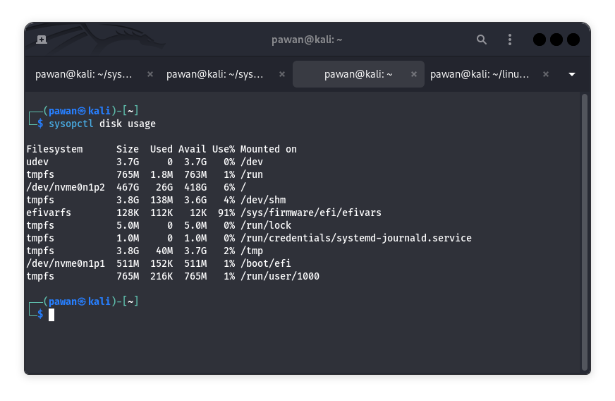

#SECTION A
```bash
.TH SYSOPCTL 1 "December 2024" "sysopctl version 1.0.0" "User Commands"
.SH NAME
sysopctl \- A command-line tool for managing system services, processes, logs, and backups.
.SH SYNOPSIS
.B sysopctl
[\fIcommand\fR] [\fIoptions\fR]
.SH DESCRIPTION
sysopctl is a tool that provides a simple command-line interface for managing various aspects of the system including services, processes, system logs, disk usage, and backups.

.SH COMMANDS
.TP
.B service
Manage system services.
.IP list
List all running services.
.IP start \fIservice-name\fR
Start the specified service.
.IP stop \fIservice-name\fR
Stop the specified service.

.TP
.B system
Show system information.
.IP load
Display current system load averages (similar to uptime).

.TP
.B disk
Display disk usage statistics.
.IP usage
Show disk usage by partition (similar to df -h).

.TP
.B process
Monitor system processes in real-time.
.IP monitor
Display system processes with top or htop.

.TP
.B logs
Analyze system logs.
.IP analyze
Show the last 50 critical log entries using journalctl.

.TP
.B backup
Backup system files or directories.
.IP \fIpath\fR
Backup the specified directory or file.

.SH OPTIONS
.TP
.B \--help
Show help information about sysopctl commands and usage.
.TP
.B \--version
Display the version information of sysopctl.

.SH EXAMPLES
.TP
sysopctl service list
List all running services.
.TP
sysopctl service start nginx
Start the nginx service.
.TP
sysopctl backup /etc/nginx
Backup the /etc/nginx directory.

.SH SEE ALSO
.B systemctl(1), df(1), top(1), htop(1), rsync(1)
```


# SECTION B
## PART 1
## List Running Services:

## View System Load:


# PART 2
## Manage System Services:
## sysopctl service stop nginx

## sysopctl service start nginx

## Check Disk Usage:



# PART 3
## Monitor System Processes:

##  Monitor System Processes:

## Analyze System Logs:

